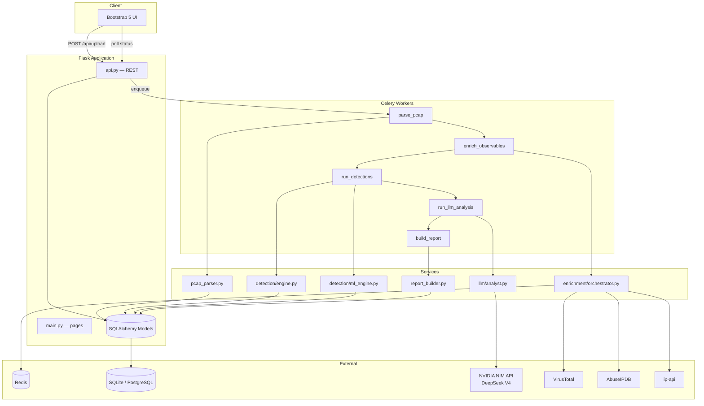

# packetEye

**AI-Powered Network Forensics & Threat Hunting Platform**

packetEye ingests PCAP/CAP network captures, reconstructs every flow, enriches observables with threat intelligence, runs 17 detection rules plus ML anomaly scoring, and uses **NVIDIA NIM (DeepSeek V4)** to produce plain-English analyst narratives, executive summaries, and hunt hypotheses.

---

## Table of Contents

1. [What packetEye Does](#1-what-packeye-does)
2. [System Architecture](#2-system-architecture)
3. [Technology Stack](#3-technology-stack)
4. [Directory Structure](#4-directory-structure)
5. [Application Bootstrap](#5-application-bootstrap)
6. [Database Models](#6-database-models)
7. [Analysis Pipeline (Celery Tasks)](#7-analysis-pipeline-celery-tasks)
8. [PCAP Parser](#8-pcap-parser)
9. [Enrichment Layer](#9-enrichment-layer)
10. [Detection Engine](#10-detection-engine)
11. [ML Anomaly Engine](#11-ml-anomaly-engine)
12. [LLM Layer (NVIDIA NIM / DeepSeek V4)](#12-llm-layer-nvidia-nim--deepseek-v4)
13. [Report Builder](#13-report-builder)
14. [Web UI & REST API](#14-web-ui--rest-api)
15. [Whitelist Engine](#15-whitelist-engine)
16. [Configuration Reference](#16-configuration-reference)
17. [Quick Start](#17-quick-start)
18. [Security Notes](#18-security-notes)

---

## 1. What packetEye Does

When an analyst uploads a PCAP file:

1. **Parse** — Reconstruct 5-tuple flows (src IP, dst IP, ports, protocol) and extract DNS queries, HTTP hosts, TLS SNI, JA3 hashes, ARP events.
2. **Enrich** — Fan out to VirusTotal, AbuseIPDB, WHOIS, and ip-api for every unique IP/domain (cached in Redis).
3. **Detect** — Evaluate 17 YAML-defined rules (port scans, beaconing, DNS tunneling, etc.) and score flows with Isolation Forest ML.
4. **Analyze (LLM)** — Call **DeepSeek V4 Pro** via NVIDIA's free NIM API to explain findings, write an executive summary, and propose hunt hypotheses.
5. **Report** — Assemble metrics, charts, geo map data, and export formats (HTML, JSON, STIX2, CSV).

The frontend polls `/api/analysis/<id>/status` every 3 seconds and shows a live progress bar.

---

<p align="center">
  
</p>

## 2. System Architecture



### Design principles

| Principle | Implementation |
|-----------|----------------|
| **Async pipeline** | Long-running work never blocks the Flask request thread; Celery tasks chain sequentially. |
| **Progress visibility** | Each task updates `Analysis.status` and `Analysis.progress_pct` in the database. |
| **Pluggable LLM** | `LLMProvider` abstraction supports NVIDIA (default), OpenAI, Anthropic. |
| **Optional enrichment** | Missing API keys skip that provider; the pipeline still completes. |
| **Rule-driven detection** | New detections = new YAML file in `detection_rules/` — no code change required for parameters. |

---

## 3. Technology Stack

| Layer | Technology | Role |
|-------|------------|------|
| Backend | Python 3.11+, Flask | App factory, routes, templates |
| Task queue | Celery + Redis | 5-stage analysis pipeline |
| PCAP parsing | `dpkt` | Fast binary packet dissection |
| Database | SQLite (dev) / PostgreSQL (prod) | Analyses, flows, findings |
| Frontend | Bootstrap 5, Chart.js, Leaflet | Upload, dashboard, report |
| **LLM (default)** | **NVIDIA NIM + DeepSeek V4 Pro** | Free API at `integrate.api.nvidia.com` |
| ML | scikit-learn Isolation Forest | Unsupervised flow anomaly scoring |
| Enrichment | aiohttp + asyncio | Concurrent API fan-out |

---

## 4. Directory Structure

```
packetEye/
├── app/
│   ├── __init__.py              # create_app() — Flask factory
│   ├── config.py                # Environment-based configuration classes
│   ├── extensions.py            # db, cache, celery, limiter singletons
│   │
│   ├── models/
│   │   ├── analysis.py          # Analysis, Flow, Observable, Finding
│   │   └── user.py              # User (optional Flask-Login auth)
│   │
│   ├── routes/
│   │   ├── main.py              # HTML pages: /, /dashboard, /report/<id>
│   │   ├── api.py               # REST JSON API under /api/*
│   │   └── auth.py              # Login/logout (optional)
│   │
│   ├── services/
│   │   ├── pcap_parser.py       # PCAP → flows + observables
│   │   ├── enrichment/          # Threat intel API clients
│   │   ├── detection/           # Rules + ML + scoring
│   │   ├── llm/                 # NVIDIA/OpenAI/Anthropic providers
│   │   └── report_builder.py    # Final report JSON assembly
│   │
│   ├── tasks/
│   │   └── analysis_tasks.py    # Celery task chain definitions
│   │
│   ├── templates/               # Jinja2 HTML (Bootstrap 5)
│   └── static/                  # CSS, JavaScript
│
├── detection_rules/             # YAML rule definitions (17 rules)
├── whitelist/                   # Known-good CIDRs/domains
├── tests/                       # pytest unit tests
├── .env                         # Local secrets (gitignored)
├── .env.example                 # Template for configuration
├── run.py                       # `python run.py` → Flask dev server
└── celery_worker.py             # Celery worker entry point
```

---

## 5. Application Bootstrap

### `app/__init__.py` — `create_app()`

This is the **application factory**. It:

1. Loads `.env` via `python-dotenv`
2. Selects config class (`DevelopmentConfig`, `ProductionConfig`, `TestingConfig`)
3. Initializes extensions: `db`, `cache`, `login_manager`, `limiter`, `celery`
4. Registers blueprints: `main_bp`, `api_bp`, `auth_bp`
5. Creates database tables with `db.create_all()`
6. Imports Celery tasks so they register with the worker

### `app/config.py`

| Class | Purpose |
|-------|---------|
| `Config` | Base settings from environment variables |
| `DevelopmentConfig` | `DEBUG=True`, `SimpleCache`, `CELERY_TASK_ALWAYS_EAGER=True` (no Redis needed) |
| `ProductionConfig` | Production flags |
| `TestingConfig` | In-memory SQLite, LLM disabled |

Key defaults for LLM:

```python
LLM_PROVIDER = "nvidia"
LLM_MODEL = "deepseek-ai/deepseek-v4-pro"
NVIDIA_API_BASE = "https://integrate.api.nvidia.com/v1"
```

### `app/extensions.py`

| Object | Library | Purpose |
|--------|---------|---------|
| `db` | Flask-SQLAlchemy | ORM and migrations |
| `cache` | Flask-Caching | Enrichment + LLM response cache |
| `celery_app` | Celery | Async task broker |
| `limiter` | Flask-Limiter | Rate limit uploads (10/hour) |
| `login_manager` | Flask-Login | Optional authentication |

`init_celery(app, celery_app)` wraps every Celery task in Flask application context so `db.session` works inside workers.

---

## 6. Database Models

All models live in `app/models/analysis.py`.

### `Analysis`

Represents one uploaded PCAP and its pipeline state.

| Field | Type | Meaning |
|-------|------|---------|
| `id` | UUID string | Primary key, returned to client after upload |
| `filename` | str | Original upload name |
| `file_path` | str | UUID-based path on disk |
| `status` | enum string | `queued` → `parsing` → `enriching` → `analyzing` → `complete` / `failed` |
| `progress_pct` | int 0–100 | Frontend progress bar value |
| `risk_score` | float 0–10 | Composite severity from findings |
| `summary_json` | JSON | Dashboard stats, executive summary text |
| `report_json` | JSON | Full assembled report for UI/export |

**Method:** `to_dict()` — serializes for REST API responses.

### `Flow`

One reconstructed network flow (5-tuple + statistics + artifacts).

| Field group | Examples |
|-------------|----------|
| Identity | `src_ip`, `dst_ip`, `src_port`, `dst_port`, `protocol` |
| Statistics | `bytes_sent`, `bytes_recv`, `duration_ms`, `packets_sent` |
| Artifacts | `dns_queries`, `http_hosts`, `tls_sni`, `ja3_hash`, `user_agents` |
| Scoring | `anomaly_score`, `severity_score`, `rule_flags`, `is_whitelisted` |
| Enrichment | `enrichment_json` — merged provider results |

### `Observable`

A unique indicator extracted from traffic (deduplicated per analysis).

| Field | Meaning |
|-------|---------|
| `type` | `ip`, `domain`, `ja3`, `cert_hash`, `url`, `user_agent` |
| `value` | The indicator string |
| `enrichment_status` | `pending`, `complete`, `error`, `cached` |
| `is_malicious` | Unified verdict from all providers |
| `confidence` | 0.0–1.0 agreement score |

### `Finding`

A security detection result (from rules, ML, or LLM).

| Field | Meaning |
|-------|---------|
| `rule_id` | e.g. `BEACON-001`, `ML-ANOMALY-001` |
| `source` | `rule`, `ml`, `llm`, `ti_correlation` |
| `severity` | `critical`, `high`, `medium`, `low`, `info` |
| `evidence` | JSON with flows, IPs, stats that triggered the rule |
| `mitre_tactic` / `mitre_technique` | ATT&CK mapping |
| `llm_explanation` | DeepSeek-generated plain-English text |
| `recommendation` | Actionable analyst next step |
| `is_false_positive` | Set via analyst feedback API |

---

## 7. Analysis Pipeline (Celery Tasks)

Defined in `app/tasks/analysis_tasks.py`. Tasks chain automatically — each task calls `.delay()` on the next.

### Progress mapping

| Stage | Task | Progress % | What happens |
|-------|------|------------|--------------|
| 1 | `parse_pcap` | 0 → 25 | Read PCAP, create Flow + Observable rows |
| 2 | `enrich_observables` | 25 → 55 | Async API fan-out per observable |
| 3 | `run_detections` | 55 → 70 | YAML rules + Isolation Forest |
| 4 | `run_llm_analysis` | 70 → 90 | DeepSeek enriches findings |
| 5 | `build_report` | 90 → 100 | Executive summary, hypotheses, report JSON |

### Function reference

#### `run_analysis(analysis_id)`
Entry point called from `/api/upload`. Dispatches `parse_pcap.delay(analysis_id)`.

#### `parse_pcap(analysis_id)`
- Instantiates `PCAPParser(file_path)`
- Calls `parser.parse(progress_callback=...)` — streams packets, builds flows
- Inserts `Flow` and `Observable` rows into database
- Sets `analysis.total_flows`
- Chains to `enrich_observables`

#### `enrich_observables(analysis_id, arp_events)`
- Creates `EnrichmentOrchestrator` with app config
- Runs `enrich_analysis_sync()` — asyncio event loop inside worker
- Updates each `Observable.enrichment_json`, `is_malicious`, `confidence`
- Chains to `run_detections`

#### `run_detections(analysis_id, arp_events)`
- Loads all flows and observables from DB
- Runs `DetectionEngine.run()` — returns list of `Finding` objects
- Saves findings, updates flow `anomaly_score`
- Chains to `run_llm_analysis`

#### `run_llm_analysis(analysis_id)`
- Creates `LLMAnalyst` → calls `enrich_findings()` for medium+ severity findings
- Chains to `build_report` (even if LLM fails)

#### `build_report(analysis_id)`
- `LLMAnalyst.generate_executive_summary()` — one DeepSeek call
- `LLMAnalyst.generate_hunt_hypotheses()` — one DeepSeek call
- `ReportBuilder.build()` — assembles charts, metrics, geo markers
- Sets `status=complete`, `progress_pct=100`, `completed_at`

#### `_update_progress(analysis_id, status, pct)`
Helper that commits `Analysis.status` and `Analysis.progress_pct` to DB.

---

## 8. PCAP Parser

**File:** `app/services/pcap_parser.py`

### Class: `PCAPParser`

#### `__init__(file_path)`
Stores path and initializes empty `flows`, `arp_events`, `observables` dicts.

#### `parse(progress_callback=None) → dict`
Main entry point:
1. Detects PCAP vs PCAPNG magic bytes
2. Iterates packets with `dpkt.pcap.Reader` or `dpkt.pcapng.Reader`
3. Calls `_process_packet(ts, buf)` for each packet
4. Returns `{"flows": [...], "observables": [...], "arp_events": [...]}`

#### `_process_packet(ts, buf)`
- Parses Ethernet frame
- Handles ARP → appends to `arp_events`
- Handles IP → dispatches TCP, UDP, or ICMP
- Creates/updates `FlowState` dataclass per 5-tuple

#### `_inspect_tcp_payload(flow, tcp, ...)`
Extracts application-layer data:
- **TLS/443:** SNI via `_extract_sni()`, JA3 via `_compute_ja3()`
- **HTTP/80:** Host header, User-Agent from `dpkt.http.Request`
- **SSH/445/3389:** Sets `application_layer` label

#### `_inspect_udp_payload(flow, udp, ...)`
- Port 53 → parses `dpkt.dns.DNS`, extracts query names

#### `_track_observable(type, value, ts)`
Deduplicates observables; increments `occurrence_count`.

### Helper functions

| Function | Purpose |
|----------|---------|
| `validate_pcap_magic(file_path)` | Server-side file validation (not just extension) |
| `is_private_ip(ip)` / `is_external_ip(ip)` | RFC1918 checks for detection rules |
| `_extract_sni(data)` | Manual TLS ClientHello SNI parse |
| `_compute_ja3(tls)` | MD5 of cipher/extension string |

### `FlowState` dataclass
In-memory flow accumulator before DB insert — holds packet times, DNS sets, HTTP hosts, TLS fields.

---

## 9. Enrichment Layer

**Orchestrator:** `app/services/enrichment/orchestrator.py`

### Class: `EnrichmentOrchestrator`

#### Routing logic

| Observable type | Providers called |
|-----------------|------------------|
| `ip` | VirusTotal, AbuseIPDB, geo (ip-api), WHOIS (rDNS) |
| `domain` | VirusTotal, WHOIS |

#### Key methods

| Method | Description |
|--------|-------------|
| `_cache_key(provider, type, value)` | Redis key: `enrich:{provider}:{type}:{hash}` |
| `_get_cached` / `_set_cache` | 24-hour TTL (configurable) |
| `_enrich_ip(ip)` | Concurrent async calls to all IP providers |
| `_enrich_domain(domain)` | VT + WHOIS |
| `_compute_verdict(enrichment)` | Merges provider signals → `is_malicious`, `confidence` |
| `enrich_observable(obs)` | Single observable enrichment |
| `enrich_all(analysis_id)` | Semaphore-limited parallel enrichment of all observables |
| `enrich_analysis_sync(analysis_id)` | `asyncio.run()` wrapper for Celery |

#### Verdict thresholds

| Provider | Flag condition |
|----------|----------------|
| VirusTotal | `malicious > 2` |
| AbuseIPDB | `abuseConfidenceScore > 25` |
| WHOIS | Domain registered < 30 days ago |

### Provider modules

| File | Class | API |
|------|-------|-----|
| `virustotal.py` | `VirusTotalClient` | VT v3 REST, token bucket 4 req/min |
| `abuseipdb.py` | `AbuseIPDBClient` | AbuseIPDB v2 check |
| `whois_lookup.py` | `WhoisClient` | `python-whois` + `socket.gethostbyaddr` |
| `geo_asn.py` | `GeoASNClient` | ip-api.com (free) or MaxMind GeoLite2 |

---

## 10. Detection Engine

**File:** `app/services/detection/engine.py`

### Class: `DetectionEngine`

#### `__init__(config)`
- Loads YAML rules via `load_rules(DETECTION_RULES_DIR)`
- Initializes `WhitelistEngine`
- Initializes `MLEngine` with threshold and model path

#### `run(analysis_id, flows, arp_events, observables) → list[Finding]`
1. Marks whitelisted flows (`is_whitelisted=True`)
2. Evaluates each YAML rule against non-whitelisted flows
3. Runs ML scoring on all active flows
4. Returns combined list of `Finding` objects (not yet committed)

#### `_evaluate_rule(rule, flows, arp_events, observables)`
Dispatches to handler by `rule["id"]`:

| Rule ID | Handler | Logic summary |
|---------|---------|---------------|
| `PORTSCAN-001` | `_portscan_horizontal` | >50 ports on same dst IP in 30s |
| `PORTSCAN-002` | `_portscan_vertical` | Same port on >30 dst IPs in 60s |
| `BEACON-001` | `_beacon` | Regular intervals, CV < 20% |
| `BEACON-002` | `_beacon_slow` | Beacon interval > 30 min |
| `DNSTUNNEL-001` | `_dns_payload` | DNS payload > 200 bytes |
| `DNSTUNNEL-002` | `_dns_frequency` | >100 queries/min to apex |
| `DNSTUNNEL-003` | `_dns_entropy` | Subdomain entropy > 3.8 |
| `ARPSPOOFING-001` | `_arp_gratuitous` | Gratuitous ARP events |
| `ARPSPOOFING-002` | `_arp_storm` | >50 ARP replies in 10s |
| `PORTMISMATCH-001` | `_port_mismatch` | SSH/HTTP/DNS on wrong ports |
| `EXFIL-001` | `_exfil` | Outbound bytes > 10× baseline |
| `LATERAL-001` | `_lateral` | Internal scan on 445/3389/5985 |
| `DGATOP-001` | `_dga` | High consonant/vowel ratio or bigram entropy |
| `TLSNONSNI-001` | `_tls_no_sni` | TLS to external IP without SNI |
| `CLEARTEXT-001` | `_cleartext` | HTTP POST to auth endpoints |
| `NEWDOMAIN-001` | `_new_domain` | WHOIS age < 30 days |
| `LONGCONN-001` | `_long_conn` | TCP flow > 8 hours |

### Rule YAML format (`detection_rules/*.yaml`)

```yaml
- id: BEACON-001
  name: Beaconing — periodic outbound connection
  description: >
    Repeated connections at regular intervals indicating C2 check-in.
  severity: high
  enabled: true
  mitre_tactic: TA0011 - Command and Control
  mitre_technique: T1071 - Application Layer Protocol
  parameters:
    min_connections: 10
    max_jitter_pct: 20
  recommendation: >
    Isolate the source host and examine the destination certificate.
```

Rules are loaded by `app/services/detection/rules.py` → `load_rules()` which reads all `*.yaml` files and filters `enabled: false`.

### Scoring (`scoring.py`)

| Function | Purpose |
|----------|---------|
| `severity_to_score(severity)` | Maps critical→10, high→8, medium→5, etc. |
| `compute_analysis_risk_score(findings)` | Top-5 finding average, capped at 10 |

---

## 11. ML Anomaly Engine

**File:** `app/services/detection/ml_engine.py`

### Algorithm: Isolation Forest (scikit-learn)

Unsupervised — no labeled malware required. Flows that are "easy to isolate" in feature space are anomalous.

### Feature vector (11 dimensions)

| Feature | Transform |
|---------|-----------|
| `bytes_total_log` | log1p(bytes_sent + bytes_recv) |
| `packets_total` | Raw count |
| `duration_ms_log` | log1p(duration) |
| `bytes_per_packet` | bytes / packets |
| `iat_mean`, `iat_std` | Inter-arrival time stats |
| `dst_port` | Raw port number |
| `dst_port_entropy` | Entropy of ports accessed by src IP |
| `is_external_dst` | 1 if dst not RFC1918 |
| `time_of_day_hour` | 0–23 |
| `protocol_encoded` | TCP=1, UDP=2, ICMP=3 |

### Class: `MLEngine`

| Method | Description |
|--------|-------------|
| `score_flows(flows)` | Builds feature matrix, runs Isolation Forest, returns scores + explanations |
| `_simple_explanations(features_df, scores)` | Text: "flagged due to unusual {feature}" |

### Training modes

1. **No baseline model** — fits Isolation Forest on first 80% of flows in the capture
2. **Pre-trained** — loads `ml_models/isolation_forest_base.pkl` if present

Scores normalized from Isolation Forest range (-1, 0) to **0–10** via `normalize_if_score()`. Flows above `ML_ANOMALY_THRESHOLD` (default 7.5) create `Finding` with `source='ml'`.

---

## 12. LLM Layer (NVIDIA NIM / DeepSeek V4)

**Default provider:** NVIDIA free NIM API with **DeepSeek V4 Pro**.

Get a free API key at [build.nvidia.com](https://build.nvidia.com) → copy `nvapi-...` key.

### Architecture

```
LLMAnalyst (analyst.py)
    └── get_provider(config) → NVIDIAProvider | OpenAIProvider | AnthropicProvider
            └── complete(system, user, temperature) → raw text
                    └── parse_json_response() → dict
                            └── complete_with_retry() → up to 3 attempts
```

### `app/services/llm/provider.py`

#### `NVIDIAProvider` (default)

Uses the **OpenAI Python SDK** pointed at NVIDIA's endpoint:

```python
client = OpenAI(
    base_url="https://integrate.api.nvidia.com/v1",
    api_key=os.environ["NVIDIA_API_KEY"],
)
response = client.chat.completions.create(
    model="deepseek-ai/deepseek-v4-pro",
    messages=[{"role": "system", ...}, {"role": "user", ...}],
    extra_body={"chat_template_kwargs": {"thinking": False}},  # reliable JSON
)
```

| Model | Use case |
|-------|----------|
| `deepseek-ai/deepseek-v4-pro` | Best quality (default) — finding analysis, summaries |
| `deepseek-ai/deepseek-v4-flash` | Faster, lower latency — high-volume or dev |

#### Other providers

| Class | When to use |
|-------|-------------|
| `OpenAIProvider` | Set `LLM_PROVIDER=openai`, `LLM_API_KEY=sk-...` |
| `AnthropicProvider` | Set `LLM_PROVIDER=anthropic` |

#### Utility functions

| Function | Purpose |
|----------|---------|
| `get_provider(config)` | Factory — reads `LLM_PROVIDER` env var |
| `parse_json_response(text)` | Extracts JSON from LLM output (handles markdown fences) |
| `complete_with_retry(...)` | Exponential backoff, max 3 retries |

### `app/services/llm/analyst.py` — `LLMAnalyst`

| Method | Temperature | Output |
|--------|-------------|--------|
| `enrich_findings(analysis_id)` | 0.2 | Per-finding JSON: explanation, recommendation, confidence |
| `generate_executive_summary(analysis_id)` | 0.3 | 3–5 paragraph stakeholder summary |
| `generate_hunt_hypotheses(analysis_id)` | 0.5 | 3–5 investigation hypotheses with steps |

**Cost control:** `_call_count` capped at `LLM_MAX_CALLS_PER_ANALYSIS` (default 25). Responses cached in Redis by SHA256 of input — reload never re-queries.

### `app/services/llm/prompts.py`

Template strings: `SYSTEM_ANALYST`, `FINDING_PROMPT`, `EXECUTIVE_SUMMARY_PROMPT`, `HUNT_HYPOTHESES_PROMPT`.

The LLM **never receives raw packet bytes** — only structured JSON metadata (flow stats, enrichment verdicts, MITRE context).

---

## 13. Report Builder

**File:** `app/services/report_builder.py`

### Class: `ReportBuilder`

#### `build(analysis_id, executive_summary, hunt_hypotheses) → dict`

Assembles the final report object stored in `Analysis.report_json`:

| Section | Contents |
|---------|----------|
| `analysis` | Analysis metadata via `to_dict()` |
| `executive_summary` | DeepSeek-generated text |
| `hunt_hypotheses` | List of hypothesis cards |
| `risk_score` | From `compute_analysis_risk_score()` |
| `metrics` | Flow counts, external IPs, malicious IOCs, severity breakdown |
| `charts` | Protocol pie, top talkers, traffic timeline, DNS top domains, port heatmap |
| `geo_markers` | Lat/lon from ip-api enrichment for Leaflet map |

---

## 14. Web UI & REST API

### HTML pages (`app/routes/main.py`)

| Route | Template | Purpose |
|-------|----------|---------|
| `GET /` | `index.html` | Drag-and-drop PCAP upload |
| `GET /dashboard` | `dashboard.html` | Analysis history table |
| `GET /analysis/<id>` | `analysis_progress.html` | Live progress bar (polls API) |
| `GET /report/<id>` | `report.html` | Full 8-section report |

### JavaScript

| File | Role |
|------|------|
| `static/js/upload.js` | Client validation, `POST /api/upload`, redirect to progress |
| `static/js/report.js` | Leaflet threat map, false-positive feedback |
| `static/js/charts.js` | Chart.js: risk gauge, protocol pie, talkers, timeline |

### REST API (`app/routes/api.py`)

| Method | Endpoint | Function |
|--------|----------|----------|
| POST | `/api/upload` | `upload()` — validate PCAP, save file, enqueue `run_analysis` |
| GET | `/api/analysis/<id>/status` | `analysis_status()` — poll progress |
| GET | `/api/analysis/<id>/summary` | Top stats + report |
| GET | `/api/analysis/<id>/findings` | Filterable findings list |
| GET | `/api/analysis/<id>/flows` | Paginated flow table |
| GET | `/api/analysis/<id>/observables` | Enriched IOCs |
| GET | `/api/analysis/<id>/report.json` | Full report JSON |
| GET | `/api/analysis/<id>/report.html` | Self-contained HTML export |
| GET | `/api/analysis/<id>/stix2.json` | STIX2 bundle |
| GET | `/api/analysis/<id>/export.csv` | Flows CSV download |
| DELETE | `/api/analysis/<id>` | Delete analysis + PCAP file |
| POST | `/api/analysis/<id>/feedback` | Mark finding false positive |
| GET | `/api/health` | Health + API key status |

---

## 15. Whitelist Engine

**File:** `detection_rules/../whitelist/default_whitelist.yaml`  
**Class:** `WhitelistEngine` in `detection/engine.py`

Excludes known-good traffic from findings:

| Rule type | Example |
|-----------|---------|
| CIDR ranges | Cloudflare, Google DNS, CloudFront |
| Domain patterns | `*.google.com`, `windowsupdate.microsoft.com` |
| Port/protocol | UDP/53, TCP/443, TCP/80 |

`is_whitelisted_flow(flow_dict)` sets `Flow.is_whitelisted=True`; whitelisted flows skip rule evaluation.

---

## 16. Configuration Reference

Copy `.env.example` to `.env`:

```bash
# NVIDIA NIM — default LLM (free at build.nvidia.com)
LLM_PROVIDER=nvidia
NVIDIA_API_KEY=nvapi-your-key-here
NVIDIA_API_BASE=https://integrate.api.nvidia.com/v1
LLM_MODEL=deepseek-ai/deepseek-v4-pro
LLM_MAX_TOKENS=2048
LLM_MAX_CALLS_PER_ANALYSIS=25
LLM_ENABLED=true

# Optional enrichment
VIRUSTOTAL_API_KEY=
ABUSEIPDB_API_KEY=

# Database
DATABASE_URL=sqlite:///packeteye.db

# Dev mode (no Redis)
CELERY_TASK_ALWAYS_EAGER=true
CACHE_TYPE=SimpleCache
```

| Variable | Default | Description |
|----------|---------|-------------|
| `LLM_PROVIDER` | `nvidia` | `nvidia`, `openai`, or `anthropic` |
| `NVIDIA_API_KEY` | — | `nvapi-...` from build.nvidia.com |
| `LLM_MODEL` | `deepseek-ai/deepseek-v4-pro` | Or `deepseek-ai/deepseek-v4-flash` |
| `ML_ANOMALY_THRESHOLD` | `7.5` | Flows scoring above this create ML findings |
| `MAX_UPLOAD_MB` | `500` | Upload size limit |
| `WHITELIST_ENABLED` | `true` | Toggle whitelist filtering |

---

## 17. Quick Start

```powershell
cd packetEye
python -m venv venv
.\venv\Scripts\activate
pip install -r requirements.txt
copy .env.example .env
# Edit .env — add your NVIDIA_API_KEY from build.nvidia.com
python run.py
```

Open **http://localhost:5000**, upload a `.pcap` file, watch progress, view report.

### Production (with Redis + Celery worker)

```powershell
# Terminal 1
python run.py

# Terminal 2
celery -A celery_worker.celery_app worker --loglevel=info
```

### Run tests

```powershell
pytest tests/ -v
```

---

## 18. Security Notes

- **Never commit `.env`** — it is listed in `.gitignore`. API keys belong only in environment variables.
- **Rotate exposed keys** — if a key was shared in chat or logs, regenerate it at build.nvidia.com.
- PCAP files may contain credentials — stored with restricted permissions under `data/uploads/`.
- Upload rate limited to 10/hour per IP via Flask-Limiter.
- LLM receives **metadata only** — never raw packet payloads.
- Observable values are HTML-escaped in templates to prevent XSS from malicious domain names.

---

**packetEye v1.0** — HackingBay Rwanda | Cybersecurity Division
