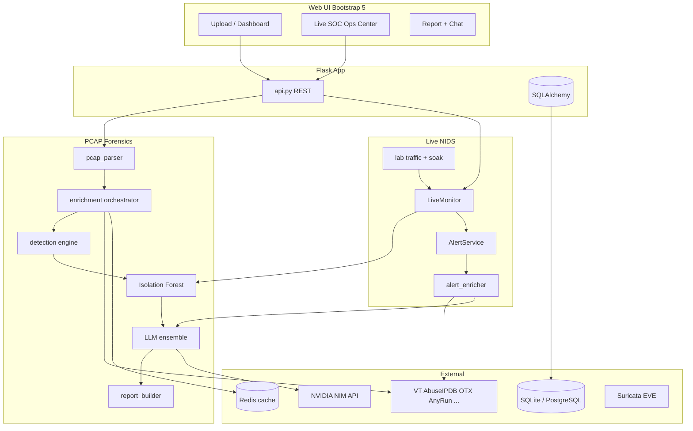

# packetEye

**AI-powered network forensics, live NIDS, and SOC operations platform**

packetEye combines **offline PCAP analysis** with **real-time network intrusion detection**. Upload captures for deep forensics, or run live on Suricata/tcpdump with Isolation Forest ML scoring, multi-provider OSINT, ensemble LLM analysis, and a unified SOC operations center.

<p align="center">
  
</p>

---

## Table of Contents

1. [Overview](#1-overview)
2. [Features at a Glance](#2-features-at-a-glance)
3. [Quick Start](#3-quick-start)
4. [Feature Guide](#4-feature-guide)
   - [PCAP Forensics Pipeline](#41-pcap-forensics-pipeline)
   - [Live NIDS & SOC Ops Center](#42-live-nids--soc-ops-center)
   - [ML Anomaly Detection](#43-ml-anomaly-detection)
   - [Rule-Based Detection](#44-rule-based-detection)
   - [OSINT Enrichment](#45-osint-enrichment)
   - [LLM Intelligence (Ensemble)](#46-llm-intelligence-ensemble)
   - [Lab Traffic & Malicious Soak Validation](#47-lab-traffic--malicious-soak-validation)
   - [Suricata Integration](#48-suricata-integration)
   - [Unified Capture (tcpdump / Suricata)](#49-unified-capture-tcpdump--suricata)
   - [SOC Chatbot](#410-soc-chatbot)
   - [Reports & Export](#411-reports--export)
   - [Alert Webhooks](#412-alert-webhooks)
   - [Whitelist & False-Positive Control](#413-whitelist--false-positive-control)
5. [Architecture](#5-architecture)
6. [REST API Reference](#6-rest-api-reference)
7. [Configuration](#7-configuration)
8. [Project Structure](#8-project-structure)
9. [Training & Scripts](#9-training--scripts)
10. [Security](#10-security)
11. [Documentation](#11-documentation)

---

## 1. Overview

packetEye operates in two complementary modes:

| Mode | Input | Output |
|------|--------|--------|
| **Forensics** | Uploaded PCAP/CAP files | Flows, findings, OSINT, LLM narratives, HTML/STIX2/CSV reports |
| **Live NIDS** | Suricata EVE JSON or tcpdump + Scapy feed | Real-time ML alerts, Suricata hits, SOC queue, enhanced LLM synthesis |

Both modes share the same **20-feature Isolation Forest model** (trained on CIC-IDS2017 BENIGN traffic), **YAML detection rules**, **OSINT orchestrator**, and **LLM ensemble**.

---

## 2. Features at a Glance

| Feature | Description |
|---------|-------------|
| PCAP parsing | 5-tuple flows, DNS/HTTP/TLS/JA3/ARP extraction via `dpkt` |
| 17+ detection rules | Port scan, beaconing, DNS tunnel, ARP spoof, exfil, DGA, etc. |
| ML anomalies | Isolation Forest on 20 flow features, 0–10 calibrated score |
| Live ML + Suricata | Tail EVE or tcpdump; correlate signature + ML hits |
| 12+ OSINT providers | VT, AbuseIPDB, OTX, GreyNoise, AnyRun, Shodan, URLScan, … |
| LLM ensemble | NVIDIA DeepSeek + GLM secondary + OpenRouter fallback |
| Live alert synthesis | CIC attack labels, OSINT, FP suppression on emit |
| SOC Ops Center | `/live` — capture, ML, Suricata, lab, soak test, inspector |
| Malicious soak test | Rotate all 13 CIC-style attack patterns; coverage report |
| SOC chatbot | Markdown + mermaid context from flows, alerts, OSINT |
| Export | HTML, JSON, STIX2, CSV, PCAP chunks, Suricata EVE |
| Webhooks | Discord-compatible alert notifications |

---

## 3. Quick Start

### Install

```powershell
cd packetEye
python -m venv venv
.\venv\Scripts\activate
pip install -r requirements.txt
copy .env.example .env
```

Edit `.env` — minimum for LLM: `NVIDIA_API_KEY` from [build.nvidia.com](https://build.nvidia.com).

### Run (development)

```powershell
python run.py
```

Open **http://127.0.0.1:5050** (Windows may block port 5000; `run.py` auto-falls back to 5050).

### First PCAP analysis

1. Go to **Upload** → drop a `.pcap` file.
2. Watch progress on the analysis page (polls every 3s).
3. Open the **Report** when complete.

### First live NIDS session

1. Set `LIVE_MONITOR_ENABLED=true` and `SURICATA_EVE_PATH` (or start capture from UI).
2. Open **Live Monitor** → **Capture** tab → Start capture + ML.
3. Watch alerts on **SOC Overview**.

### Malicious traffic validation (soak test)

```bash
# Terminal 1
python run.py

# Terminal 2 (Git Bash / WSL / Linux)
chmod +x scripts/run_nids_soak_test.sh
./scripts/run_nids_soak_test.sh --interface eth0
```

Requires `CAPTURE_LAB_ENABLED=true`. See [docs/NIDS_SETUP.md](docs/NIDS_SETUP.md).

### Production (Redis + Celery)

```powershell
# Terminal 1
python run.py

# Terminal 2
celery -A celery_worker.celery_app worker --loglevel=info
```

### Tests

```powershell
pytest tests/ -v
```

---

## 4. Feature Guide

### 4.1 PCAP Forensics Pipeline

**Logic:** Upload → parse → enrich → detect → LLM → report (Celery chain, or inline when `CELERY_TASK_ALWAYS_EAGER=true`).

```
POST /api/upload
  → parse_pcap        (0–25%)   dpkt → Flow + Observable rows
  → enrich_observables (25–55%) async OSINT fan-out
  → run_detections    (55–70%)  YAML rules + Isolation Forest
  → run_llm_analysis  (70–90%)  finding narratives + summary
  → build_report      (90–100%) charts, geo, export JSON
```

| Stage | What happens |
|-------|----------------|
| **Parse** | Reconstruct flows; extract DNS, HTTP Host, TLS SNI, JA3, ARP |
| **Enrich** | VirusTotal, AbuseIPDB, geo, WHOIS per observable (Redis cache, 24h TTL) |
| **Detect** | 17 YAML rules + ML scoring; whitelist skips known-good traffic |
| **LLM** | DeepSeek (via NVIDIA NIM) explains findings, executive summary, hunt hypotheses |
| **Report** | Risk score, Chart.js metrics, Leaflet geo map, STIX2/CSV export |

**Key files:** `app/services/pcap_parser.py`, `app/tasks/analysis_tasks.py`, `app/services/report_builder.py`

**Enrichment mode:** `ENRICHMENT_MODE=bulk` (legacy, all observables at ingest) or `on_investigate` (OSINT only when analyst investigates — default).

---

### 4.2 Live NIDS & SOC Ops Center

**UI:** `/live` — unified tabs: SOC Console, **AI Triage**, Capture, Suricata, ML, Lab.

**AI Triage** (`/live/ai-triage`):

- Toggle dual-model packet triage (~30 packets/min × primary + secondary NVIDIA models).
- Unified incident table: Suricata, ML, LLM, heuristics, correlation — **including benign/true-negative rows**.
- Analyst verdicts: TP / FP / TN per row; deep inspect drawer for extended LLM briefing.
- API: `GET/POST /api/live/llm-packets`, `GET /api/live/triage/incidents`, `POST /api/live/triage/inspect|verdict`, `GET /api/live/triage/status`, `POST /api/llm/test`.

**Logic:**

1. **Start live session** — `POST /api/live/start` with mode `suricata` or `tcpdump`.
2. **Attach ML** — `ml_capture.attach_ml_to_capture()` creates a live `Analysis` row and starts `LiveMonitor`.
3. **Ingest flows** — Suricata EVE `flow` events or Scapy packet feed → feature extraction → Isolation Forest.
4. **Emit alerts** — Scores ≥ `ML_ANOMALY_THRESHOLD` (default 5.0) → `AlertService` → SOC queue + optional webhook.
5. **Suricata alerts** — When `LIVE_INGEST_SURICATA_ALERTS=true`, signature hits appear alongside ML alerts.
6. **Correlation** — ML + Suricata hits on same host pair within `LIVE_CORRELATION_WINDOW` seconds are linked.

**Enhanced alerts** (`ALERT_ENHANCED_ANALYSIS=true`, `LLM_LIVE_ALERT_SYNTHESIS=true`):

- On emit: async OSINT on destination IP + LLM maps traffic to CIC-IDS2017 labels.
- CDN/cloud FP suppression via `ml_alert_suppressed()` in `app/services/net_utils.py`.

**Key files:** `app/services/live/monitor.py`, `app/services/live/alert_service.py`, `app/services/live/alert_enricher.py`

---

### 4.3 ML Anomaly Detection

**Algorithm:** scikit-learn **Isolation Forest** (unsupervised).

**Training:** CIC-IDS2017 all-days **BENIGN** traffic → `scripts/train_baseline.py` or interactive `scripts/train_tracker.py`.

**Artifacts** (`ml_models/`):

| File | Purpose |
|------|---------|
| `isolation_forest_base.pkl` | Trained model |
| `feature_scaler.pkl` | MinMaxScaler |
| `feature_schema.json` | 20-feature column order (schema v3) |
| `score_calibration.json` | Maps raw scores → 0–10 scale (5.0 = decision boundary) |
| `recommended_threshold.json` | Output of `scripts/tune_threshold.py` |
| `benchmark_results.json` | CIC evaluation metrics |

**20 features** (shared across PCAP, live EVE, tcpdump):

`dst_port`, `duration_ms_log`, directional packets/bytes, throughput rates, packet size stats, IAT stats, `dst_port_entropy`, `is_external_dst`, `time_of_day_hour`, `protocol_encoded`.

**Scoring logic:**

- Raw `decision_function` → calibrated 0–10 via `ScoreCalibrator`.
- Flows ≥ threshold → `Finding` with `source='ml'`.
- Tune with `python scripts/tune_threshold.py` → set `ML_ANOMALY_THRESHOLD` in `.env`.

---

### 4.4 Rule-Based Detection

**Location:** `detection_rules/*.yaml` — no code change needed to add rules.

| Rule family | Examples |
|-------------|----------|
| Port scan | Horizontal (>50 ports/dst), vertical (>30 IPs/port) |
| Beaconing | Regular intervals (CV < 20%), slow beacon (>30 min) |
| DNS tunnel | Large payloads, high frequency, high subdomain entropy |
| ARP | Gratuitous ARP, ARP storms |
| Protocol mismatch | SSH/HTTP/DNS on wrong ports |
| Exfil / lateral | Outbound byte spikes, internal SMB/RDP scan |
| DGA / TLS / cleartext | Domain generation, TLS without SNI, HTTP auth POST |
| Long connection | TCP > 8 hours |

**Engine:** `DetectionEngine.run()` evaluates rules → creates `Finding` rows with MITRE tactic/technique, evidence JSON, recommendations.

**PCAP Suricata replay:** When `PCAP_SURICATA_ENABLED=true`, uploaded PCAPs are replayed against `deploy/suricata/custom.rules`.

---

### 4.5 OSINT Enrichment

**Orchestrator:** `app/services/enrichment/orchestrator.py` — async fan-out with Redis cache.

**IP providers:**

| Provider | Key required | Verdict weight |
|----------|--------------|----------------|
| VirusTotal | Yes | High (`malicious > 2`) |
| AbuseIPDB | Yes | High (`abuseConfidenceScore > 25`) |
| OTX | Optional | Medium (`pulse_count > 2`) |
| GreyNoise | Optional | High (classification = malicious) |
| AnyRun TI Lookup | Optional | High (`threat_level >= 2`) |
| Shodan API | Optional | Context |
| Shodan InternetDB | No | Context (vulns boost confidence) |
| Pulsedive | Optional | Context |
| IPInfo | Optional | Context |
| ThreatFox | No | Context |
| Geo / WHOIS | Optional / No | Context |

**Domain providers:** VT, WHOIS, OTX, crt.sh, URLScan, AnyRun.

**Investigate flow:** `POST /api/investigate/finding/<id>` → on-demand lookup → verdict breakdown UI with per-provider signals.

**Key files:** `app/services/enrichment/`, `app/static/js/osint_detail.js`, `app/static/js/investigate.js`

---

### 4.6 LLM Intelligence (Ensemble)

**Default stack:**

1. **Primary** — NVIDIA NIM `deepseek-ai/deepseek-v4-pro` (`integrate.api.nvidia.com`)
2. **Secondary** — NVIDIA NIM `z-ai/glm-5.2` (parallel on big tasks)
3. **Fallback** — OpenRouter (`OPENROUTER_API_KEY`)

**Ensemble logic** (`app/services/llm/ensemble.py`):

| Task type | Behavior |
|-----------|----------|
| Big tasks (exec summary, hunt, live alerts, findings) | Primary + GLM in **parallel** → synthesis prompt merges to one JSON conclusion |
| Chat (large context) | Same parallel + merge for Markdown |
| Any failure | Fallback chain: primary → GLM → OpenRouter |

**Use cases:**

| Component | Output |
|-----------|--------|
| `LLMAnalyst.enrich_findings()` | Per-finding explanation, recommendation, confidence |
| `generate_executive_summary()` | Stakeholder narrative |
| `generate_hunt_hypotheses()` | 3–5 investigation hypotheses |
| `alert_enricher` | Live alert CIC label, severity, FP risk |
| SOC chatbot | Markdown tables, mermaid diagrams |

**Safety:** LLM receives structured JSON metadata only — never raw packet bytes. Responses cached in Redis by input hash. Circuit breaker after consecutive failures.

---

### 4.7 Lab Traffic & Malicious Soak Validation

**Purpose:** Generate synthetic CIC-IDS2017-style attacks to validate that NIDS + ML + alerts work end-to-end.

**13 attack patterns** (`app/services/lab/patterns.py`):

`portscan`, `bot`, `ddos`, `dos_goldeneye`, `dos_hulk`, `dos_slowhttptest`, `dos_slowloris`, `ftp_patator`, `ssh_patator`, `web_brute`, `dns`, `infiltration`, `arp`

**Components:**

| Component | Role |
|-----------|------|
| `scripts/generate_test_traffic.py` | Scapy packet generator (`--forever`, `--pattern all`) |
| `app/services/lab/traffic_runner.py` | Background process + live log |
| `app/services/lab/nids_test_runner.py` | Capture + ML + lab + coverage tracking |
| `scripts/run_nids_soak_test.sh` | CLI soak until Ctrl+C |

**Coverage tracking:** For each pattern rotation, tracks whether **ML** and **Suricata** alerts increased → `pattern_coverage` in `/api/nids-test/status`.

**How to run:**

```bash
# CLI
./scripts/run_nids_soak_test.sh --interface eth0 --rotate 12

# Dashboard
Live → Lab → NIDS + ML Soak Test

# API
POST /api/nids-test/start  {"with_lab": true, "rotate_sec": 12}
GET  /api/nids-test/status   → pattern_coverage[]
POST /api/nids-test/stop
```

**Requirements:** `CAPTURE_LAB_ENABLED=true`, `LIVE_MONITOR_ENABLED=true`. Linux/WSL recommended for Scapy injection; Windows can monitor external Suricata EVE with `--no-lab`.

One full rotation ≈ 13 patterns × 12s ≈ **2.5 minutes**.

---

### 4.8 Suricata Integration

**Features:**

- Process management (start/stop from browser on Linux sensors)
- EVE path auto-discovery from `suricata.yaml` (`AUTO_SYNC_EVE=true`)
- External Suricata plug-in: import EVE, rebind without restart
- Custom rules in `deploy/suricata/custom.rules`
- Live table with row actions, selected export
- Diagnostics, interface list, preflight checks

**Key files:** `app/services/live/suricata_manager.py`, `app/static/js/live_suricata.js`

See [docs/SURICATA_SETUP.md](docs/SURICATA_SETUP.md).

---

### 4.9 Unified Capture (tcpdump / Suricata)

**Modes** (`CAPTURE_MODE`):

| Mode | Capture | ML input |
|------|---------|----------|
| `suricata` | Suricata on mirror interface → EVE JSON | EVE flow events |
| `tcpdump` | Rotating PCAP chunks | Scapy live packet feed |

**API:** `POST /api/capture/start`, `POST /api/capture/stop`, `GET /api/capture/status`

**Export:** PCAP chunks, EVE JSON, packet summaries.

**Linux notes:** Run as root (`sudo python run.py`). Avoid tcpdump writes under `$HOME` on Kali (AppArmor) — use `/tmp/packeteye/chunks-*` or set `TCPDUMP_CHUNK_DIR`.

---

### 4.10 SOC Chatbot

**UI:** Floating chat widget on live/report pages.

**Logic:** `POST /api/chat` → builds rich JSON context (flows, findings, alerts, OSINT) → LLM ensemble → Markdown reply with tables and optional mermaid attack-path diagrams.

**Config:** `CHATBOT_ENABLED=true`, `CHATBOT_MAX_HISTORY=10`, `CHATBOT_MAX_CONTEXT_CHARS=32000`

---

### 4.11 Reports & Export

| Format | Endpoint |
|--------|----------|
| Interactive HTML | `/report/<id>` |
| JSON report | `GET /api/analysis/<id>/report.json` |
| HTML export | `GET /api/analysis/<id>/report.html` |
| STIX2 bundle | `GET /api/analysis/<id>/stix2.json` |
| Flows CSV | `GET /api/analysis/<id>/export.csv` |
| Suricata EVE export | `GET /api/suricata/export` |
| PCAP / chunks | `GET /api/capture/export-packets`, `/api/capture/download-chunks` |

**Report sections:** Executive summary, hunt hypotheses, risk gauge, protocol pie, top talkers, timeline, DNS chart, port heatmap, Leaflet threat map.

---

### 4.12 Alert Webhooks

**Config:** `ALERT_WEBHOOK_URL` (Discord-compatible), `ALERT_WEBHOOK_MIN_SEVERITY`, `ALERT_WEBHOOK_RATE_LIMIT`.

**Logic:** On live alert emit, if severity ≥ minimum and rate limit allows → POST embed JSON to webhook.

**Test:** `POST /api/webhook/test`

---

### 4.13 Whitelist & False-Positive Control

**File:** `whitelist/default_whitelist.yaml` — CIDR ranges, domain patterns, port/protocol allowlists (Cloudflare, Google DNS, etc.).

**Logic:** Whitelisted flows skip rule evaluation and ML alert emission. Analysts mark findings FP via `POST /api/analysis/<id>/feedback`.

**Live FP:** CDN/cloud suppression in `ml_alert_suppressed()`; mark-FP action in SOC inspector.

---

## 5. Architecture



---

## 6. REST API Reference

### PCAP forensics

| Method | Endpoint | Description |
|--------|----------|-------------|
| POST | `/api/upload` | Upload PCAP, start analysis |
| GET | `/api/analysis/<id>/status` | Progress polling |
| GET | `/api/analysis/<id>/summary` | Stats + report preview |
| GET | `/api/analysis/<id>/findings` | Filterable findings |
| GET | `/api/analysis/<id>/flows` | Paginated flows |
| GET | `/api/analysis/<id>/observables` | Enriched IOCs |
| GET | `/api/analysis/<id>/report.json` | Full report JSON |
| GET | `/api/analysis/<id>/report.html` | HTML export |
| GET | `/api/analysis/<id>/stix2.json` | STIX2 bundle |
| GET | `/api/analysis/<id>/export.csv` | Flows CSV |
| POST | `/api/analysis/<id>/feedback` | Mark false positive |
| DELETE | `/api/analysis/<id>` | Delete analysis |

### Live NIDS

| Method | Endpoint | Description |
|--------|----------|-------------|
| GET | `/api/live/config` | Live monitor context |
| POST | `/api/live/start` | Start capture + ML (suricata/tcpdump) |
| POST | `/api/live/stop` | Stop live session |
| GET | `/api/live/status` | Session stats |
| GET | `/api/live/alerts` | ML + Suricata + LLM alerts (filter by severity/source) |
| GET/POST | `/api/live/llm-packets` | Toggle dual-model live packet triage |
| GET | `/api/live/triage/incidents` | Unified triage table (disposition/source filters) |
| POST | `/api/live/triage/inspect` | Deep LLM analysis for one incident row |
| POST | `/api/live/triage/verdict` | Analyst TP/FP/TN + optional note |
| GET | `/api/live/triage/status` | Triage runner stats + registry counts |
| POST | `/api/llm/test` | Probe primary + secondary NVIDIA models |
| POST | `/api/live/rebind-eve` | Point session at new EVE path |
| POST | `/api/live/import-eve` | Upload/import external EVE |

### Capture

| Method | Endpoint | Description |
|--------|----------|-------------|
| GET | `/api/capture/status` | Capture + ML session state |
| POST | `/api/capture/start` | Start tcpdump or Suricata |
| POST | `/api/capture/stop` | Stop capture |
| GET | `/api/capture/export-packets` | Export packet summary |
| GET | `/api/capture/download-chunks` | Download tcpdump chunks |

### Suricata

| Method | Endpoint | Description |
|--------|----------|-------------|
| GET | `/api/suricata/status` | Process + EVE path |
| POST | `/api/suricata/start` | Start Suricata |
| POST | `/api/suricata/stop` | Stop Suricata |
| GET/POST | `/api/suricata/rules` | List / save custom rules |
| POST | `/api/suricata/rules/generate` | AI rule draft from natural language |
| POST | `/api/suricata/rules/test` | Validate draft rules (`suricata -T`) |
| GET | `/api/suricata/export` | Export EVE alerts |

### OSINT investigate

| Method | Endpoint | Description |
|--------|----------|-------------|
| POST | `/api/investigate/finding/<id>` | Run OSINT for finding IPs/domains |
| GET | `/api/investigate/finding/<id>` | Investigation status |
| GET | `/api/investigate/target/<analysis_id>/<target>` | On-demand IOC lookup |

### Lab & soak validation

| Method | Endpoint | Description |
|--------|----------|-------------|
| POST | `/api/lab/start` | Start lab traffic (all 13 patterns default) |
| POST | `/api/lab/stop` | Stop lab generator |
| GET | `/api/lab/status` | Lab log + pattern queue |
| POST | `/api/nids-test/start` | Full soak: capture + ML + lab + coverage |
| POST | `/api/nids-test/stop` | Stop soak test |
| GET | `/api/nids-test/status` | Stats + `pattern_coverage` |

### Other

| Method | Endpoint | Description |
|--------|----------|-------------|
| POST | `/api/chat` | SOC chatbot |
| GET | `/api/ml/benchmark` | CIC benchmark JSON |
| GET | `/api/dashboard/overview` | Dashboard KPIs |
| GET | `/api/health` | Health + API key status |
| POST | `/api/webhook/test` | Test alert webhook |

---

## 7. Configuration

Copy `.env.example` → `.env` (never commit `.env`).

### Essential

| Variable | Default | Description |
|----------|---------|-------------|
| `NVIDIA_API_KEY` | — | LLM via NVIDIA NIM (`nvapi-...`) |
| `LLM_MODEL` | `deepseek-ai/deepseek-v4-pro` | Primary model |
| `LLM_SECONDARY_MODEL` | `z-ai/glm-5.2` | Ensemble secondary |
| `LLM_ENSEMBLE_ENABLED` | `true` | Parallel + synthesis |
| `OPENROUTER_API_KEY` | — | Fallback LLM (optional) |
| `ML_ANOMALY_THRESHOLD` | `5.0` | Alert threshold (0–10 scale) |
| `LIVE_MONITOR_ENABLED` | `false` | Enable live NIDS |
| `SURICATA_EVE_PATH` | — | Path to Suricata `eve.json` |

### OSINT (optional — more keys = richer context)

`VIRUSTOTAL_API_KEY`, `ABUSEIPDB_API_KEY`, `GREYNOISE_API_KEY`, `OTX_API_KEY`, `ANYRUN_API_KEY`, `SHODAN_API_KEY`, `URLSCAN_API_KEY`, `PULSEDIVE_API_KEY`, `IPINFO_TOKEN`

### Live / lab

| Variable | Description |
|----------|-------------|
| `CAPTURE_LAB_ENABLED` | Enable Scapy lab traffic generator |
| `LAB_ROTATE_SEC` | Seconds per attack pattern (default 12) |
| `ALERT_ENHANCED_ANALYSIS` | OSINT + LLM on live alert emit |
| `LLM_LIVE_ALERT_SYNTHESIS` | CIC label mapping for live alerts |
| `LLM_MAX_TOKENS` | Default output cap (768; lower = fewer credit errors) |
| `LLM_SECONDARY_MAX_TOKENS` | Secondary NVIDIA model cap (512) |
| `OPENROUTER_MAX_TOKENS` | OpenRouter fallback cap (256 — match your credit balance) |
| `LLM_MAX_CONCURRENT` | Max simultaneous LLM calls (default 1 — avoids NVIDIA 429) |
| `LLM_MIN_CALL_INTERVAL_SEC` | Min gap between LLM calls (default 0.75s) |
| `LLM_ENSEMBLE_PARALLEL` | Parallel dual-model (default false; sequential shares rate limit) |
| `LLM_LIVE_PACKET_MIN_CONFIDENCE` | Min confidence before LLM alert emit |
| `LLM_LIVE_TIMEOUT_SECONDS` | Fast timeout for live triage LLM calls |
| `LIVE_ML_LAB_THRESHOLD` | Relaxed ML threshold when `CAPTURE_LAB_ENABLED=true` |
| `AUTO_SYNC_EVE` | Auto-detect external Suricata EVE path |
| `CAPTURE_MODE` | `suricata` or `tcpdump` |
| `CAPTURE_INTERFACE` | Mirror/SPAN interface |
| `ALERT_WEBHOOK_URL` | Discord-compatible webhook |

### Dev mode (no Redis)

```
CELERY_TASK_ALWAYS_EAGER=true
CACHE_TYPE=SimpleCache
```

Full reference: [.env.example](.env.example)

---

## 8. Project Structure

```
packetEye/
├── app/
│   ├── routes/           main.py, api.py, auth.py
│   ├── models/           Analysis, Flow, Observable, Finding, User
│   ├── services/
│   │   ├── pcap_parser.py
│   │   ├── enrichment/   OSINT clients + orchestrator
│   │   ├── detection/    rules, ML engine, features, scoring
│   │   ├── llm/          provider, ensemble, analyst, chat, prompts
│   │   ├── live/         monitor, alerts, suricata_manager, enricher
│   │   ├── lab/          traffic_runner, nids_test_runner, patterns
│   │   ├── capture/      orchestrator, ml_capture, pcap_watcher
│   │   └── report_builder.py
│   ├── tasks/            analysis_tasks, live_tasks
│   ├── templates/        Jinja2 + Bootstrap 5
│   └── static/           CSS, JS (live_common, live_soc, osint_detail, …)
├── detection_rules/      YAML rule definitions
├── deploy/suricata/      suricata.yaml, custom.rules
├── ml_models/            Trained model artifacts
├── scripts/              train, evaluate, soak test, migrate
├── tests/                pytest suite
├── docs/                 NIDS_SETUP, SURICATA_SETUP
├── whitelist/            default_whitelist.yaml
├── .env.example          Config template (GitHub-safe)
├── run.py                Dev server (port fallback on Windows)
└── celery_worker.py      Celery worker entry
```

---

## 9. Training & Scripts

| Script | Purpose |
|--------|---------|
| `scripts/train_tracker.py` | Interactive training pipeline (recommended) |
| `scripts/train_baseline.py` | Quick CIC-IDS2017 BENIGN train |
| `scripts/tune_threshold.py` | Sweep thresholds, recommend `ML_ANOMALY_THRESHOLD` |
| `scripts/evaluate_model.py` | CIC benchmark → `benchmark_results.json` |
| `scripts/verify_nids_setup.py` | Preflight checks |
| `scripts/migrate_db.py` | DB schema migration |
| `scripts/generate_test_traffic.py` | 13 CIC-style attack patterns (Scapy) |
| `scripts/run_nids_soak_test.sh` | Malicious traffic validation soak |

See [docs/NIDS_SETUP.md](docs/NIDS_SETUP.md) for full NIDS workflow.

---

## 10. Security

- **Never commit `.env`** — listed in `.gitignore`; rotate keys if exposed.
- PCAP files may contain credentials — stored under `data/uploads/` with restricted access.
- Upload rate limit: 10/hour per IP (Flask-Limiter).
- LLM and chatbot receive **metadata only** — no raw packet payloads.
- Observable values HTML-escaped in templates (XSS from malicious domains).
- Live capture on Linux typically requires root — run only on dedicated sensor hosts.

---

## 11. Documentation

| Document | Contents |
|----------|----------|
| [docs/NIDS_SETUP.md](docs/NIDS_SETUP.md) | ML training, live monitor, lab traffic, soak test |
| [docs/SURICATA_SETUP.md](docs/SURICATA_SETUP.md) | Suricata install, EVE logging, custom rules |

---

## Technology Stack

| Layer | Technology |
|-------|------------|
| Backend | Python 3.11+, Flask |
| Tasks | Celery + Redis (optional in dev) |
| Database | SQLite (dev) / PostgreSQL (prod) |
| PCAP | dpkt, Scapy (live/tcpdump) |
| ML | scikit-learn Isolation Forest |
| LLM | NVIDIA NIM (DeepSeek V4, GLM 5.2), OpenRouter fallback |
| Frontend | Bootstrap 5.3, Chart.js, Leaflet |
| NIDS | Suricata EVE JSON, tcpdump |

---

**packetEye** — HackingBay Rwanda | Cybersecurity Division
